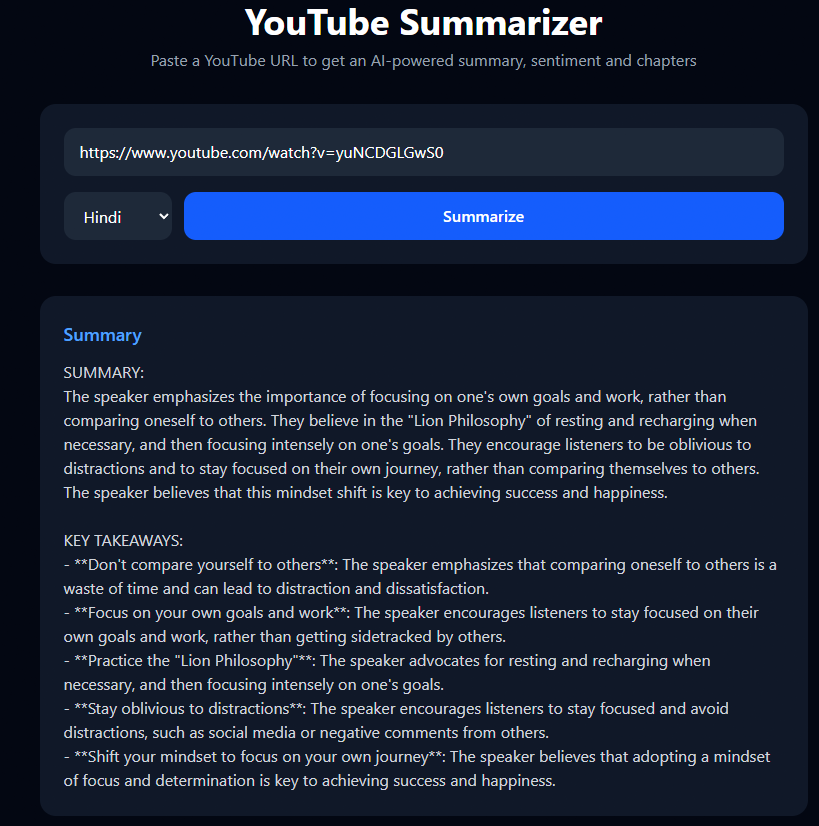
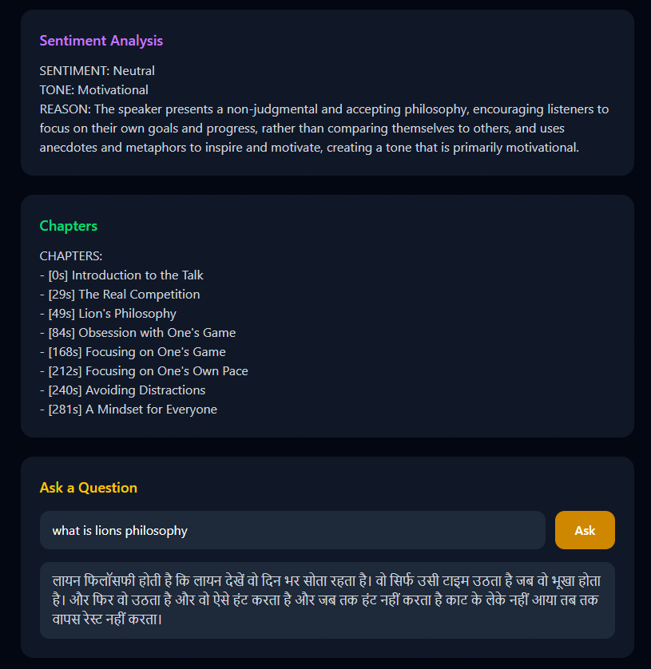

# 🎬 YouTube Summarizer

An AI-powered web application that summarizes any YouTube video in seconds. Paste a URL and instantly get a summary, sentiment analysis, chapter breakdown, and the ability to ask questions about the video.




## ✨ Features

- **AI Summary** — Concise 3-5 sentence summary with key takeaways
- **Sentiment Analysis** — Detects tone and emotional context of the video
- **Smart Chapters** — Automatically generates timestamp-based chapters
- **Q&A Chat** — Ask any question and get answers based on the video transcript
- **Multi-language** — Supports English, Hindi, Spanish, French and German
- **Export** — Download the full summary as a text file

## 🛠️ Tech Stack

| Layer | Technology |
|---|---|
| Frontend | React 19, Tailwind CSS, Vite |
| Backend | Python, FastAPI, Uvicorn |
| AI Model | Llama 3.1 8B via Groq API |
| Transcript | youtube-transcript-api |
| Version Control | Git, GitHub |

## 🏗️ Architecture

```
React Frontend (port 5173)
        ↓  HTTP POST
FastAPI Backend (port 8000)
        ↓  Fetch transcript
YouTube Transcript API
        ↓  Generate summary
Groq API (Llama 3.1)
```

## 🚀 Running Locally

### Prerequisites
- Python 3.10+
- Node.js 18+
- [Groq API Key](https://console.groq.com) (free)

### Backend Setup

```bash
cd backend
python -m venv venv
source venv/Scripts/activate  # Windows
pip install -r requirements.txt
```

Create a `.env` file inside `backend/` (see Environment Variables section below).

Start the backend:

```bash
uvicorn main:app --reload
```

### Frontend Setup

```bash
cd frontend
npm install
npm run dev
```

Open `http://localhost:5173` in your browser.

## 📁 Project Structure

```
youtube-summarizer/
├── backend/
│   ├── main.py              # FastAPI app and endpoints
│   ├── requirements.txt
│   └── services/
│       ├── transcript.py    # YouTube transcript fetching
│       └── ai.py            # Groq AI integration
├── frontend/
│   └── src/
│       ├── App.jsx          # Main React component
│       └── main.jsx         # Entry point
└── docs/
    ├── Screenshot_1.png
    └── Screenshot_2.png
```

## 🔑 Environment Variables

Create a `.env` file inside `backend/`:

```
GROQ_API_KEY=your_key_here
```

| Variable | Where to get it |
|---|---|
| `GROQ_API_KEY` | [console.groq.com](https://console.groq.com) |

## 📌 Roadmap

- [ ] Deploy frontend to Vercel
- [ ] Deploy backend to Render
- [ ] Add video history (localStorage)
- [ ] Support playlist summarization

## 👤 Author

**Gokul Ghate**  
AI/ML Engineer  
[GitHub](https://github.com/Gokul-Ghate)
